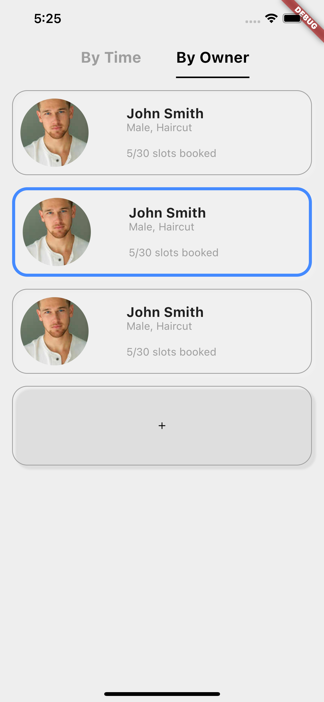

# flutter_demo_LiuWenyi

Create a small flutter demo to realize the following layout:

Two top bars source:
https://stackoverflow.com/questions/59675978/how-to-add-tabs-top-side-and-bottom-side-both-in-flutter

Widge round shape & shadow source:
https://stackoverflow.com/questions/57777737/flutter-give-container-rounded-border

JSON file read source:
https://faun.pub/flutter-implementing-listview-widget-using-json-file-fbd1e3ba60ad
